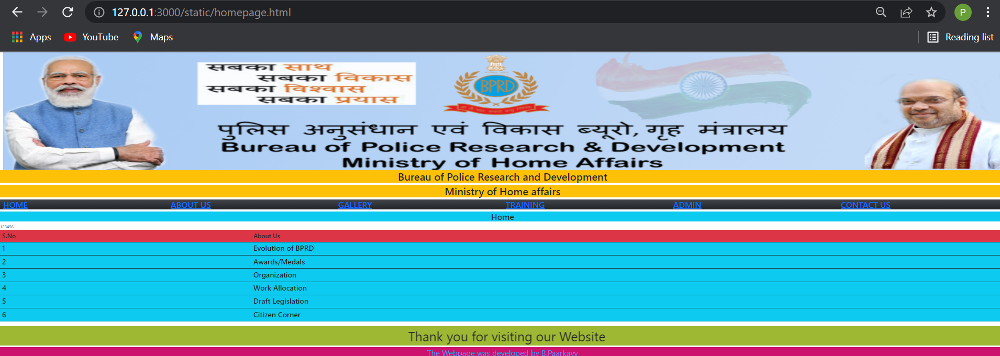
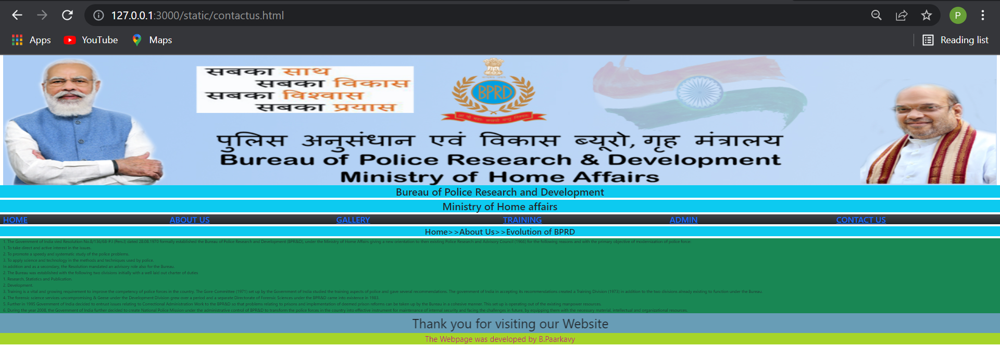
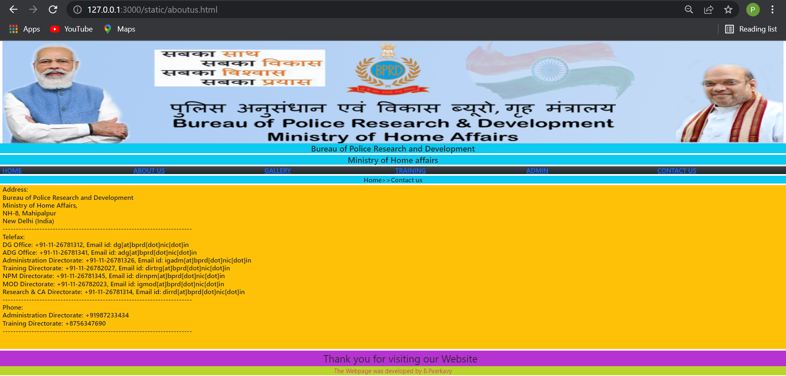

# Web Design using Bootstrap Framework

## AIM:
To design a website using bootstrap framework.

## DESIGN STEPS:

### Step 1:

Requirement collection.

### Step 2:

Creating the layout using bootstrap grid system.

### Step 3:

Updating the sample content.

### Step 4:

Choose the appropriate style and color scheme.

### Step 5:

Validate the layout in various browsers.

### Step 6:

Validate the HTML code.

### Step 6:

Publish the website in the given URL.

## PROGRAM :
## HOME PAGE:
```
<!DOCTYPE html>
<html lang="en">
<head>
    <meta charset="UTF-8">
    <meta http-equiv="X-UA-Compatible" content="IE=edge">
    <meta name="viewport" content="width=device-width, initial-scale=1.0">
    <title>BPRD HOME PAGE</title>
    <link rel="icon" href="./img/logo.png" type="image/x-icon" />    <link href="https://cdn.jsdelivr.net/npm/bootstrap@5.0.2/dist/css/bootstrap.min.css" rel="stylesheet" integrity="sha384-EVSTQN3/azprG1Anm3QDgpJLIm9Nao0Yz1ztcQTwFspd3yD65VohhpuuCOmLASjC" crossorigin="anonymous">
<script src="https://cdn.jsdelivr.net/npm/bootstrap@5.0.2/dist/js/bootstrap.bundle.min.js" integrity="sha384-MrcW6ZMFYlzcLA8Nl+NtUVF0sA7MsXsP1UyJoMp4YLEuNSfAP+JcXn/tWtIaxVXM" crossorigin="anonymous"></script>
</head>
<body>
    <div class="container-fluid">
        <div class="row">
            

            <div class="col-sm-12 bg-warning h1 text-center">Bureau of Police Research and Development</div>
            <div class="col-sm-12 bg-warning h1 text-center">Ministry of Home affairs</div>
            <div class="col-sm-2 h2  bg-dark bg-gradient"><a href="/static/home.html">HOME</a></div>
            <div class="col-sm-2 h2  bg-dark bg-gradient"><a href="/static/about.html">ABOUT US</a></div>
            <div class="col-sm-2 h2  bg-dark bg-gradient"><a href="/static/gallery.html">GALLERY</a></div>
            <div class="col-sm-2 h2  bg-dark bg-gradient"><a href="/static/training.html">TRAINING</a></div>
            <div class="col-sm-2 h2  bg-dark bg-gradient"><a href="/static/admin.html">ADMIN</a></div>
            <div class="col-sm-2 h2  bg-dark bg-gradient"><a href="/static/contactus.html">CONTACT US</a></div>
            <h2 class="text-center bg-info">Home</h2>            
        
            <table class="table">
                <thead>
                    <tr>
                        <th  class="h4 bg-danger" scope="col">S.No</th>
                        <th class="h4 bg-danger" scope="col">About Us</th>
                    </tr>
                <tbody>
                    <tr scope="row">1</tr>
                    <td class="col-sm-3 h3 bg-info bg-info">1</td>
                    <td class="col-sm-9 h3 bg-info bg-info">Evolution of BPRD</td>
                </tbody>
                <tbody>
                    <tr scope="row">2</tr>
                    <td class=" col-sm-3 h3 bg-info bg-info">2</td>
                    <td class=" col-sm-9 h3 bg-info bg-info">Awards/Medals</td>
                </tbody>
                <tbody>
                    <tr scope="row">3</tr>
                    <td class=" col-sm-3 h3 bg-info bg-info">3</td>
                    <td class=" col-sm-9 h3 bg-info bg-info">Organization</td>
                </tbody>
            <tbody>
                <tr scope="row">4</tr>
                <td class="col-sm-3 h3 bg-info bg-info">4</td>
                <td class="col-sm-9 h3 bg-info bg-info">Work Allocation</td>
            </tbody>
            <tbody>
                <tr scope="row">5</tr>
                <td class=" col-sm-3 h3 bg-info bg-info">5</td>
                <td class=" col-sm-9 h3 bg-info bg-info">Draft Legislation</td>
            </tbody>
            <tbody>
                <tr scope="row">6</tr>
                <td class=" col-sm-3 h3 bg-info bg-info">6</td>
                <td class=" col-sm-9 h3 bg-info bg-info">Citizen Corner</td>
            </tbody>

                </thead>
            </table>

        </div>
      
    </div>
    <marquee>Thank you for visiting our Website</marquee>
    <footer>The Webpage was developed by B.Paarkavy</footer>
 
</body>
<style>
    marquee{
        font-size: 50px;
        background-color: rgb(159, 184, 52);
    }
    footer{
        font-size: 30px;
        text-align: center;
        background-color: rgb(204, 17, 110);
        color: rgb(47, 149, 233);
    }
</style>

</html>
```
## About Us Page:

```
<!DOCTYPE html>
<html lang="en">
<head>
    <meta charset="UTF-8">
    <meta http-equiv="X-UA-Compatible" content="IE=edge">
    <meta name="viewport" content="width=device-width, initial-scale=1.0">
    <title>BPRD CONTACT PAGE</title>
    <link rel="icon" href="./img/logo.png" type="image/x-icon" />
    <link href="https://cdn.jsdelivr.net/npm/bootstrap@5.0.2/dist/css/bootstrap.min.css" rel="stylesheet" integrity="sha384-EVSTQN3/azprG1Anm3QDgpJLIm9Nao0Yz1ztcQTwFspd3yD65VohhpuuCOmLASjC" crossorigin="anonymous">
<script src="https://cdn.jsdelivr.net/npm/bootstrap@5.0.2/dist/js/bootstrap.bundle.min.js" integrity="sha384-MrcW6ZMFYlzcLA8Nl+NtUVF0sA7MsXsP1UyJoMp4YLEuNSfAP+JcXn/tWtIaxVXM" crossorigin="anonymous"></script>
</head>
<body>
    <div class="container-fluid">
        <div class="row">
            

            <div class="col-sm-12 bg-info h1 text-center">Bureau of Police Research and Development</div>
            <div class="col-sm-12 bg-info h1 text-center">Ministry of Home affairs</div>
            <div class="col-sm-2 h2  bg-dark bg-gradient"><a href="/static/home.html">HOME</a></div>
            <div class="col-sm-2 h2  bg-dark bg-gradient"><a href="/static/about.html">ABOUT US</a></div>
            <div class="col-sm-2 h2  bg-dark bg-gradient"><a href="/static/gallery.html">GALLERY</a></div>
            <div class="col-sm-2 h2  bg-dark bg-gradient"><a href="/static/training.html">TRAINING</a></div>
            <div class="col-sm-2 h2  bg-dark bg-gradient"><a href="/static/admin.html">ADMIN</a></div>
            <div class="col-sm-2 h2  bg-dark bg-gradient"><a href="/static/contactus.html">CONTACT US</a></div>
            <h2 class="text-center bg-info">Home>>Contact us</h2>
            <div class="h2 bg-warning" style="height:800px;">
                Address:</br>
             
                Bureau of Police Research and Development</br>
                Ministry of Home Affairs,</br>
                NH-8, Mahipalpur</br>
                New Delhi (India)</br>
                ------------------------------------------------------------------------</br>

                Telefax:</br>
                DG Office: +91-11-26781312, Email id: dg[at]bprd[dot]nic[dot]in</br>
                ADG Office: +91-11-26781341, Email id: adg[at]bprd[dot]nic[dot]in</br>
                Administration Directorate: +91-11-26781326, Email id: igadm[at]bprd[dot]nic[dot]in</br>
                Training Directorate: +91-11-26782027, Email id: dirtrg[at]bprd[dot]nic[dot]in</br>
                NPM Directorate: +91-11-26781345, Email id: dirnpm[at]bprd[dot]nic[dot]in</br>
                MOD Directorate: +91-11-26782023, Email id: igmod[at]bprd[dot]nic[dot]in</br>
                Research & CA Directorate: +91-11-26781314, Email id: dirrd[at]bprd[dot]nic[dot]in</br>
                ------------------------------------------------------------------------</br>

                Phone:</br>
                Administration Directorate: +91987233434</br>
                Training Directorate: +8756347690</br>
                ------------------------------------------------------------------------</br>
            
            
            
            </div>
            <marquee>Thank you for visiting our Website</marquee>
            <footer>The Webpage was developed by B.Paarkavy</footer>

        </body>
        <style>
            marquee{
                font-size: 50px;
                background-color: rgb(183, 51, 209);
            }
            footer{
                font-size: 30px;
                text-align: center;
                background-color: rgb(186, 212, 41);
                color: rgb(212, 41, 126);
            }
        </style>
        </html>
```

## Contact Us Page:
```
<!DOCTYPE html>
<html lang="en">
<head>
    <meta charset="UTF-8">
    <meta http-equiv="X-UA-Compatible" content="IE=edge">
    <meta name="viewport" content="width=device-width, initial-scale=1.0">
    <title>BPRD CONTACT PAGE</title>
    <link rel="icon" href="./img/logo.png" type="image/x-icon" />
    <link href="https://cdn.jsdelivr.net/npm/bootstrap@5.0.2/dist/css/bootstrap.min.css" rel="stylesheet" integrity="sha384-EVSTQN3/azprG1Anm3QDgpJLIm9Nao0Yz1ztcQTwFspd3yD65VohhpuuCOmLASjC" crossorigin="anonymous">
<script src="https://cdn.jsdelivr.net/npm/bootstrap@5.0.2/dist/js/bootstrap.bundle.min.js" integrity="sha384-MrcW6ZMFYlzcLA8Nl+NtUVF0sA7MsXsP1UyJoMp4YLEuNSfAP+JcXn/tWtIaxVXM" crossorigin="anonymous"></script>
</head>
<body>
    <div class="container-fluid">
        <div class="row">
            

            <div class="col-sm-12 bg-info h1 text-center">Bureau of Police Research and Development</div>
            <div class="col-sm-12 bg-info h1 text-center">Ministry of Home affairs</div>
            <div class="col-sm-2 h2  bg-dark bg-gradient"><a href="/static/home.html">HOME</a></div>
            <div class="col-sm-2 h2  bg-dark bg-gradient"><a href="/static/about.html">ABOUT US</a></div>
            <div class="col-sm-2 h2  bg-dark bg-gradient"><a href="/static/gallery.html">GALLERY</a></div>
            <div class="col-sm-2 h2  bg-dark bg-gradient"><a href="/static/training.html">TRAINING</a></div>
            <div class="col-sm-2 h2  bg-dark bg-gradient"><a href="/static/admin.html">ADMIN</a></div>
            <div class="col-sm-2 h2  bg-dark bg-gradient"><a href="/static/contactus.html">CONTACT US</a></div>
            <h2 class="text-center bg-info">Home>>Contact us</h2>
            <div class="h2 bg-warning" style="height:800px;">
                Address:</br>
             
                Bureau of Police Research and Development</br>
                Ministry of Home Affairs,</br>
                NH-8, Mahipalpur</br>
                New Delhi (India)</br>
                ------------------------------------------------------------------------</br>

                Telefax:</br>
                DG Office: +91-11-26781312, Email id: dg[at]bprd[dot]nic[dot]in</br>
                ADG Office: +91-11-26781341, Email id: adg[at]bprd[dot]nic[dot]in</br>
                Administration Directorate: +91-11-26781326, Email id: igadm[at]bprd[dot]nic[dot]in</br>
                Training Directorate: +91-11-26782027, Email id: dirtrg[at]bprd[dot]nic[dot]in</br>
                NPM Directorate: +91-11-26781345, Email id: dirnpm[at]bprd[dot]nic[dot]in</br>
                MOD Directorate: +91-11-26782023, Email id: igmod[at]bprd[dot]nic[dot]in</br>
                Research & CA Directorate: +91-11-26781314, Email id: dirrd[at]bprd[dot]nic[dot]in</br>
                ------------------------------------------------------------------------</br>

                Phone:</br>
                Administration Directorate: +91987233434</br>
                Training Directorate: +8756347690</br>
                ------------------------------------------------------------------------</br>
            
            
            
            </div>
            <marquee>Thank you for visiting our Website</marquee>
            <footer>The Webpage was developed by B.Paarkavy</footer>

        </body>
        <style>
            marquee{
                font-size: 50px;
                background-color: rgb(183, 51, 209);
            }
            footer{
                font-size: 30px;
                text-align: center;
                background-color: rgb(186, 212, 41);
                color: rgb(212, 41, 126);
            }
        </style>
        </html>

```
## OUTPUT:

## HOME PAGE:


## About Us Page:


## Contact Us Page:


## Result:
Thus the website is created using bootstrap.
